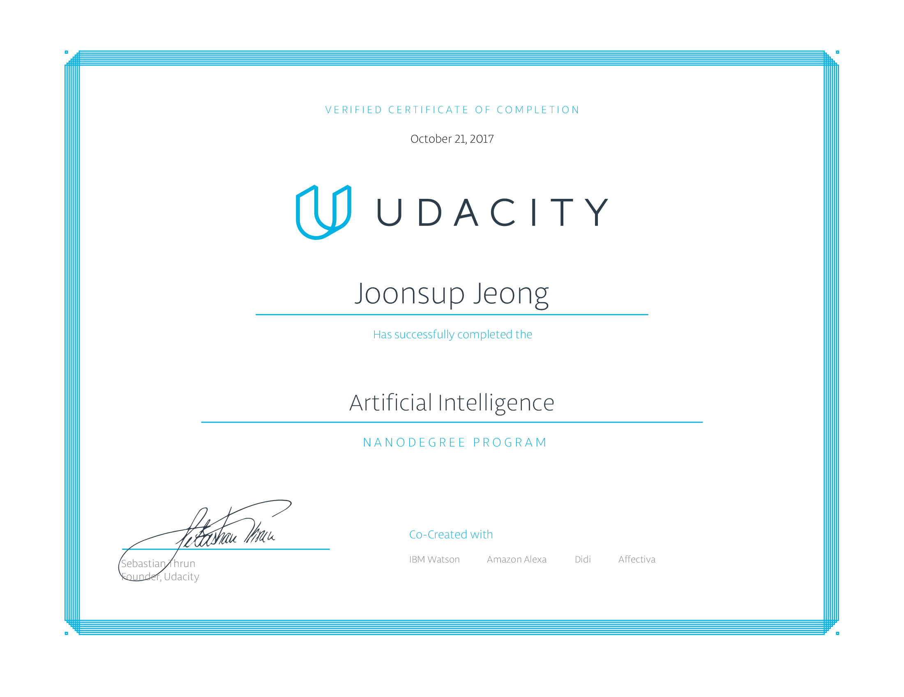

## Udacity - Artificial Intelligence Nanodegree

I have completed the AI ​​nanodegree. This repository is a collection of projects that perform ai nanodegrades.

## Foundations of AI - Term 1

1. [Solve a Sudoku with AI](1_sudoku/)
2. [Build a Game-Playing Agent](2_isolation/)
3. [Implement a Planning Search](3_planning/)
4. [Build a Sign Language Recognizer](4_recognizer/)

## Deep Learning and Applications - Term 2

5. [CNN: Dog Breed Classifier](5_dog_breed_classifier/)
6. [RNN: Apple Stock & Sherlock Holmes](6_rnn_stock_sherlock/)
7. [CNN: Facial Keypoint Detection](7_facial_keypoints/)

