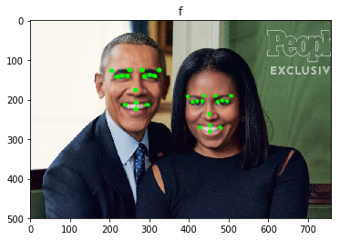

## Udacity - Artificial Intelligence Nanodegree

I have completed the AI ​​nanodegree. This repository is a collection of projects that perform ai nanodegrades.

## Foundations of AI - Term 1

1. [Solve a Sudoku with AI](1_sudoku/)
	* AI agent that will solve the Diagonal Sudoku game.
2. [Build a Game-Playing Agent](2_isolation/)
	* Game AI agent that playing isolation game.
	* 
3. [Implement a Planning Search](3_planning/)
	* Planning algorithm generated heuristics, including planning graph heuristics.
4. [Build a Sign Language Recognizer](4_recognizer/)
	* Sequencial data (hand gesture) recognizer using Hidden Markov Models (HMMs).
	
	
## Deep Learning and Applications - Term 2

5. [CNN: Dog Breed Classifier](5_dog_breed_classifier/)
	* Image classfier using CNN.
6. [RNN: Text Generation](6_rnn_text_generation/)
	* Text generator using RNN.
7. [CNN: Facial Keypoint Detection](7_facial_keypoints/)
	* End-to-end facial keypoint system using deep learning and computer vision technology.
	* 

